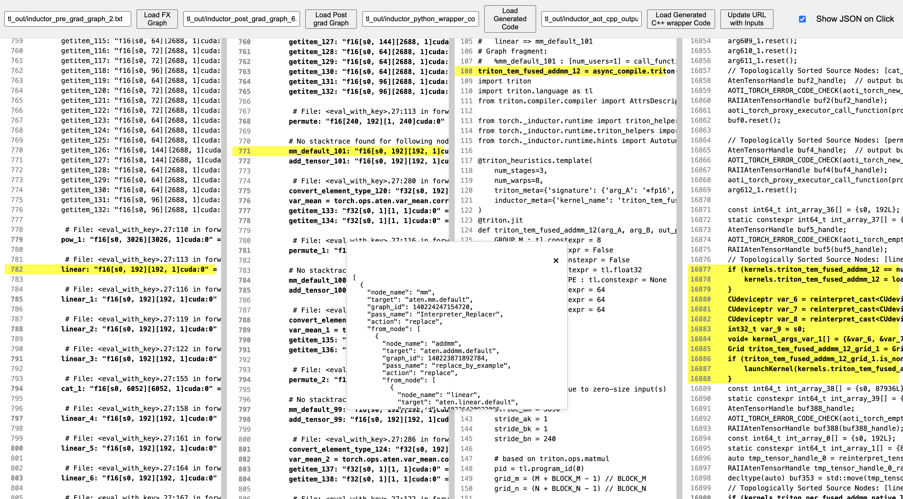

## 4-tab bidirectional provenance tracking highlighter


### Steps to run

1. Clone the repository

```
git clone git@github.com:yushangdi/compiler_explorer.git
```

2. Install the required dependencies

```
pip install -r requirements.txt
```
3. Start the web browser for the highlighter tool
```
python app.py
```
  Click on the link triggered in your console to start the web page, e.g.

  ` * Running on http://127.0.0.1:5000 `

4. Load your corresponding `pre_grad_graph.txt`, `post_grad_graph.txt`, `inductor_python_output_code.txt`, `inductor_aot_code.txt` from tlparse result.

 Currently, also one mapping.json artifact `inductor_triton_kernel_to_post_grad_nodes.json` is required. [will be consolidated into tlparse result soon.]

5. Some example inputs to try are in `tl_out/` folder.

You can load them by putting `tl_out/inductor_pre_grad_graph_2.txt` `tl_out/inductor_post_grad_graph_6.txt`, `tl_out/inductor_python_wrapper_code.txt`, `tl_out/inductor_aot_cpp_output_code.txt` in the URL boxes.


### Example screenshot:


